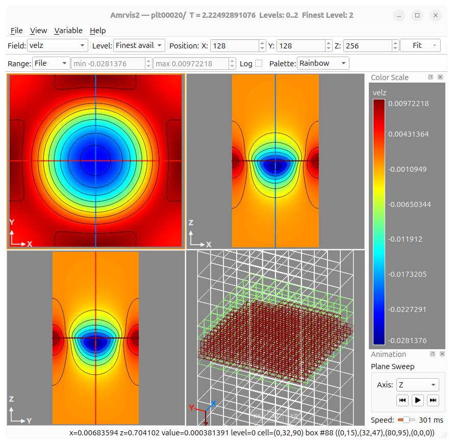

# Amrvis2 User Guide

Amrvis2 is an interactive viewer for two- and three-dimensional AMReX
plotfiles. It also opens standalone FAB and MultiFab data. This guide assumes
you are already familiar with AMReX plotfiles, variables, and refinement
levels.

For installation and build instructions, see
[INSTALL.md](https://github.com/WeiqunZhang/Amrvis2/blob/main/INSTALL.md).

## Getting started

Open a dataset from the command line:

```text
amrvis2 /path/to/plotfile
```

Pass two or more plotfile directories to open them as a time sequence:

```text
amrvis2 plt00000 plt00010 plt00020
```

You can also start without a path and use the File menu:

- **Open Plotfile Directory...** opens one AMReX plotfile.
- **Open Plotfile Sequence...** opens two or more plotfiles as animation
  frames.
- **Open FAB...** and **Open MultiFab...** open standalone data.
- **Open New Window** creates an independent viewer for side-by-side
  comparison.

Amrvis2 displays 2-D and 3-D data whose FAB payloads use IEEE 32-bit or IEEE
64-bit floating-point storage.

## User interface overview



The main controls are:

1. **Field and Level** select the plotted variable and AMR composition.
2. **3D Position** selects the cell index of each orthogonal slice plane.
3. **Scale** fits the data to a panel or uses a fixed integer zoom.
4. **Range, Log, and Palette** control the mapping from values to colors.
5. **Slice panels** display the XY, XZ, and YZ planes for a 3-D dataset.
6. **Isometric view** shows the domain, grid boxes, and current slice planes.
7. **Color Scale** reports the active value-to-color mapping.
8. **Animation** controls a 3-D plane sweep or an open plotfile sequence.

Use **View** to show or hide toolbars and dock panels. Docks can be moved,
detached, resized, and placed on another side of the main window.

## A basic 2-D workflow

1. Open a plotfile and choose a field from the **Field** control or
   **Variable** menu.
2. Choose **Finest available** to composite AMR levels, or choose an exact
   level when you need to inspect that level alone.
3. Left-drag around a region to zoom into it. Use the mouse wheel for
   additional display zoom.
4. Left-click a cell to inspect its coordinates, indices, level, and value in
   the status area.
5. Select an appropriate **Range** mode and palette.
6. Add grid boxes, contours, vectors, or line plots as needed.
7. Use **File > Export Image...** to save the current view.

Double-click a view, press **0**, or select **Fit** to return to the full
domain.

## Navigating and inspecting data

The active panel is the one most recently clicked or manipulated.

| Input | Action |
| --- | --- |
| Left click | Probe the value under the cursor |
| Left drag | Zoom to a rectangular subregion |
| Shift+left drag | Pan the view |
| Arrow keys | Pan the active panel by 5 percent |
| Mouse wheel | Zoom in or out |
| Double click | Fit the view to the window |
| Shift+middle click | Plot a horizontal line through the selected cell |
| Shift+right click | Plot a vertical line through the selected cell |
| Right drag | Plot a line; the drag direction chooses the orientation |
| Right click in a 3-D slice | Move the other two slice planes to the clicked point |

The line-plot window can accumulate curves, which is useful when comparing
variables, levels, or positions.

Choose **View > Dataset...** or press **Ctrl+D** to inspect raw cell values for
the visible physical region. Values are grouped by AMR level. Clicking a
value highlights the corresponding cell in the main view.

Choose **View > Number Format...** to set the `printf`-style format used for
numeric readouts. The default is `%7.5f`.

## Working with 3-D data

A 3-D dataset is shown as three orthogonal slices:

- **XY** has a fixed Z position.
- **XZ** has a fixed Y position.
- **YZ** has a fixed X position.

Change a plane with the X, Y, and Z index controls in **3D Position**. A right
click in any slice moves the other two planes so that all three intersect at
the selected point. Crosshairs and the isometric view show their shared
location.

Each slice panel can be navigated independently. Field, level, range,
logarithmic mapping, and palette are shared so the three panels remain
directly comparable.

The **Plane Sweep** controls in the Animation panel select an axis and step or
play through its cell indices. The speed slider controls the delay between
frames.

## Selecting fields and AMR levels

Select a field from the toolbar or the **Variable** menu.

Choose **Variable > Add Derived Field...** to define a scalar field from
existing scalar fields. Expressions are single-line algebra using `+`, `-`,
`*`, `/`, and `**`, with `sqrt`, `pow`, `exp`, `log`, `exp10`, and `log10`.
For example:

```text
sqrt(x_velocity**2 + y_velocity**2)
```

`a**b` and `pow(a,b)` are equivalent. Derived fields may reference derived
fields added earlier in the same dataset.

The level controls offer:

- **Finest available** composites data from level 0 through the finest level
  that can be loaded.
- **Levs 0-N** composites levels 0 through N.
- **Level N** displays only exact level N data.

Composite views use fine data where it exists and coarser data elsewhere.
Exact-level views are useful for checking an individual level's coverage and
values.

Useful shortcuts are:

| Shortcut | Level selection |
| --- | --- |
| Ctrl+0 | Finest available composite |
| Ctrl+1 through Ctrl+9 | Composite levels 0 through N |
| Alt+0 through Alt+9 | Exact level N |

If the finest composite cannot fit in the data cache, Amrvis2 reports the
condition and retries with a lower maximum level.

## Ranges, logarithms, and palettes

The **Range** control determines which values map to the ends of the color
scale:

- **File** uses the range over the full dataset.
- **Level** uses the selected level or composite.
- **Visible** derives the range from slice data. After a full-domain slice is
  loaded, its range remains stable while you zoom and pan.
- **User** enables explicit minimum and maximum values.

If the input does not provide complete range statistics, **File** and
**Level** are unavailable and Amrvis2 uses **Visible** instead.

Range settings are remembered separately for each field while the dataset is
open. In 3-D, all three slice panels share one range.

Enable **Log** for logarithmic color mapping. The displayed range must have a
positive minimum. If it does not, Amrvis2 falls back to linear mapping and
turns **Log** off; use a positive user minimum when necessary.

Built-in palettes include rainbow, turbo, viridis, plasma, parula, coolwarm,
and blackbody. Use **View > Palette > Load Palette File...** to load a custom
`.pal` file.

## Grid boxes, contours, and vectors

Press **B** or choose **View > Boxes** to show AMR grid boundaries.

Choose **View > Contours...** to select one of three display modes:

- **Raster** shows the color-mapped slice only.
- **Raster & Contours** overlays contour lines on the raster.
- **Velocity Vectors** overlays vector glyphs.

For contours, choose the number of lines and their color. For vectors, select
the U and V components for 2-D data, and the U, V, and W components for 3-D
data. Amrvis2 may propose fields based on common velocity names; verify the
component selections for your dataset.

## Plotfile sequences and animation

Open two or more plotfile directories with **File > Open Plotfile
Sequence...** or pass them on the command line. The Animation panel then
provides:

- a frame slider and frame number,
- the current plotfile name and simulation time,
- previous, play/pause, and next controls,
- a playback speed control.

Frame changes preserve the active field, level, range, log, palette, and
visible-region settings when those settings are valid for the next plotfile.

## Exporting images and animations

**File > Export Image...** saves the current view as PNG and asks whether to
include the color scale. A 2-D export creates one image. A 3-D export creates
separate `_xy`, `_xz`, and `_yz` images. The exported images include the
current zoom and visible overlays.

For an open plotfile sequence, **File > Export Animation...** writes numbered
PNG frames. If `ffmpeg` is installed and available on `PATH`, Amrvis2 also
encodes an MP4. Three-dimensional sequences produce separate output for each
orthogonal plane.

## Panels, preferences, and diagnostics

The **View** menu controls these optional panels:

- **Dataset Metadata** shows plotfile geometry, levels, variables, and related
  metadata.
- **Color Scale** shows the current numeric range and palette.
- **Diagnostics** reports request, I/O, and cache activity.
- **Animation** contains plane-sweep and sequence controls.

Window geometry, logarithmic mapping, palette, number format, and animation
speed persist across sessions.

Each open dataset has a 1 GiB data cache by default. Set
`AMRVIS_CACHE_SIZE_MB` to a positive number of MiB before launching to change
the initial budget:

```text
AMRVIS_CACHE_SIZE_MB=2048 amrvis2 /path/to/plotfile
```

Independent windows have independent datasets, caches, and view state.

## Keyboard and mouse quick reference

| Shortcut | Action |
| --- | --- |
| B | Toggle AMR grid boxes |
| 0 | Fit to the window |
| 1 through 6 | Use fixed scales from 1x through 32x |
| Ctrl+0 | Composite the finest available level |
| Ctrl+1 through Ctrl+9 | Composite levels 0 through N |
| Alt+0 through Alt+9 | Show exact level N |
| Ctrl+D | Open the Dataset window |

The same interaction summary is always available from **Help > Keyboard &
Mouse...**.

## Troubleshooting

**The plotfile does not open.** Verify that the selected directory contains a
valid AMReX `Header` and its `Level_N` directories. For a sequence, every
selected path must be a plotfile.

**An initial slice reports an unsupported data format.** Amrvis2 supports
IEEE-32 and IEEE-64 FAB floating-point payloads. Integer FAB payloads and other
floating-point layouts are not supported.

**The finest level cannot be displayed.** The composite may exceed the cache
budget. Increase `AMRVIS_CACHE_SIZE_MB`, reduce the visible region, or select a
lower composite maximum level.

**Log turns itself off.** The selected range has a nonpositive minimum, so
Amrvis2 has fallen back to linear mapping. Select a user range with a positive
minimum and verify that the field contains positive values.

**MP4 export is skipped.** Install `ffmpeg` and make sure the executable is on
`PATH`. The PNG frames are still written.

**Controls or panels are missing.** Use the **View** menu to restore hidden
toolbars and dock panels.

For a compact reminder of the controls, choose **Help > Keyboard & Mouse...**.
